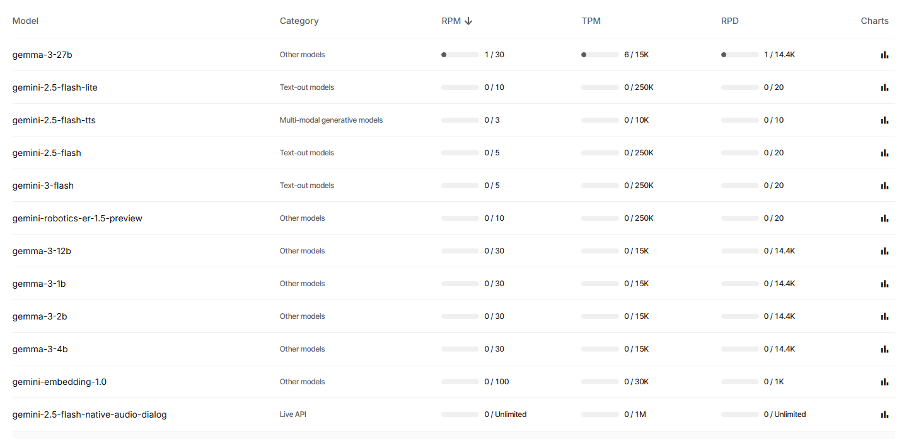
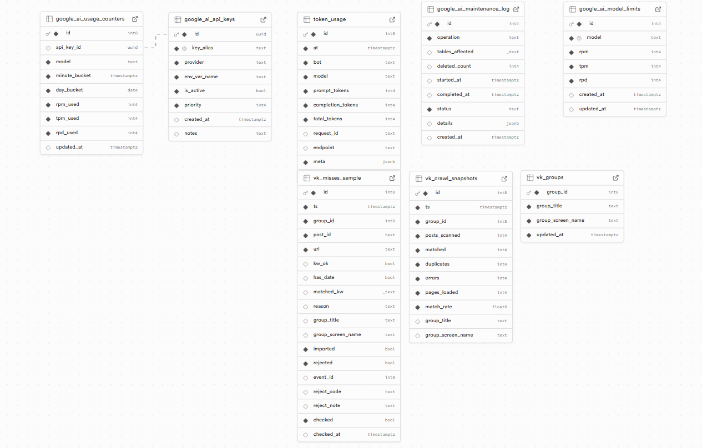

# Linear Tasks Context

> [!NOTE]
> This document contains details retrieved from Linear for agent context.

## [EVE-11](https://linear.app/events-bot-new/issue/EVE-11/globalnyj-frejmvork-upravleniya-limitami-llm)
**Title:** Глобальный фреймворк управления лимитами LLM  
**Status:** Backlog  
**Priority:** High  
**Assignee:** Zigo Maro

### Description
В системе уже есть процесс передачи информации о каждом вызове LLM в supabase. Нужно обеспечить соблюдение лимитов на запросы в LLM без конкуренции и с ретраями (3 ретрая максимум). Перед кадждым запросом в том числе ретраем нужно проверить доступность лимитов по своей модели.

Для запросов к Gemma использовать Google API, переменная GOOGLE_API_KEY, и переменная указывающая название аккаунта GOOGLE_API_LOCALNAME (лимит считается по конкретному аккаунту)

Лимиты на Google прикладываю:

Схема БД в supabase уже настроена под эту задачу:

---

## [EVE-54](https://linear.app/events-bot-new/issue/EVE-54/frejmvork-bezopasnoj-peredachi-sekretov-v-kaggle)
**Title:** Фреймворк безопасной передачи секретов в Kaggle
**Status:** Backlog
**Priority:** High
**Assignee:** Zigo Maro

### Description
FEATURE: Глобальный контроль лимитов Google AI (Gemma/Gemini) с учётом нескольких API keys и единым источником правды в Supabase

Ниже — готовая hi-end постановка (промпт) для агента в режиме оркестрации через antigravity. Текст рассчитан на копипаст целиком в задачу/агенту. В нём уже заложены требования к документации, исследованию, реализации, логированию, локальным/интеграционным/E2E тестам, а также обязательные консультации и ревью через Codex CLI.

### 1) Контекст и цель

У нас есть несколько Google AI API keys, у каждого одинаковые лимиты (на скриншоте). Несколько сервисов в системе делают запросы к моделям Gemma/Gemini и должны совместно соблюдать лимиты: **RPM (requests/min), TPM (tokens/min), RPD (requests/day)**. Уже есть Supabase БД, куда складываем данные о расходе (usage). Требуется централизованный механизм, который:

1. **Перед каждым запросом** вычисляет доступность лимитов на текущую минуту (requests/tokens) и на текущие сутки (requests/day).
2. Не допускает превышений, корректно распределяя нагрузку по пулу ключей.
3. Ведёт полный аудит: фактический расход, снимки остатка лимитов, а также попытки, заблокированные лимитами (с задержкой или ошибкой).

### 2) Лимиты (начальные значения из скриншота)

Эти значения должны быть засеяны в БД как стартовые и далее управляться из БД (единая точка правды), без хардкода в коде.

**gemma-3-27b**
- RPM: 30
- TPM: 15,000
- RPD: 14,400

**gemini-2.5-flash**
- RPM: 5
- TPM: 250,000
- RPD: 20

Важно: система должна поддерживать добавление новых моделей/лимитов через БД без изменения кода.

### 3) Описание фичи

Нужно реализовать глобальный rate limit controller для Google AI, работающий в условиях:
- несколько API keys (пул),
- несколько потребителей (сервисы),
- конкурентные запросы (параллельность),
- необходимость точного и воспроизводимого контроля без гонок.

Функциональность включает:
- хранение лимитов в БД,
- атомарное резервирование “слотов” на запрос (requests) и токены (tokens) на минутном окне,
- суточный контроль по requests/day,
- выбор API key из пула (какой ключ использовать для конкретного запроса),
- подробное логирование успехов и отказов по лимитам.

### 4) Пользовательский флоу (runtime flow)
#### 4.1. Когда сервис хочет сделать запрос к модели

Сервис вызывает единый модуль/эндпоинт GoogleAIClient / ai-gateway (выбрать подходящее под текущую архитектуру):
- передаёт: service, account_name, model, параметры запроса, а также оценку токенов (planned_input_tokens, planned_max_output_tokens) или общий planned_tokens.

Модуль делает проверку + резервирование лимитов (минутные requests/tokens + суточные requests) атомарно в Supabase Postgres.

Если резервирование успешно:
- выбирается конкретный api_key_id,
- выполняется реальный запрос в Google AI,
- по ответу извлекаются фактические токены (actual_input_tokens, actual_output_tokens, actual_total_tokens),
- выполняется reconcile (корректировка счётчиков, если фактическое отличается от зарезервированного),
- в логи пишется запись об успешном расходе + снимок остатков лимитов.

Если резервирование не удалось:
- если упёрлись в минутный лимит (RPM/TPM): возвращается/применяется задержка до следующего минутного окна (и логируется попытка + рассчитанная задержка),
- если упёрлись в суточный лимит (RPD): возвращается ошибка (и логируется попытка + причина).

#### 4.2. Политика ожидания при минутном лимите

Реализовать режимы:
- **WAIT** (по умолчанию): автоматически ждём до доступности и повторяем резервирование (с ограничением max_wait_ms, например 60–120 секунд).
- **NO_WAIT**: возвращаем структуру `{blocked: true, retry_after_ms}` без ожидания.

### 5) Требования к данным (что писать в БД и в логи)
#### 5.1. Минимум полей, которые обязательно должны быть записаны на каждую попытку расхода

- `service` — кто делает расход (например festival-bot, parser, backend-api и т.п.)
- `account_name` — имя аккаунта (человекопонятное; источник — вызывающий сервис)
- `model` — строковый id модели (например gemma-3-27b)
- `api_key_id` — какой ключ использован (или null, если запрос заблокирован до выбора ключа)
- `planned_tokens` — сколько планировали списать (или planned_input_tokens + planned_max_output_tokens)
- `actual_tokens_in/out/total` — фактический расход (для успеха)
- `requests_count` — обычно 1
- `status` — success | blocked_minute | blocked_day | error_provider | error_internal
- `retry_after_ms` — если blocked_minute
- `limit_snapshot_before` и `limit_snapshot_after` — снимки лимитов/остатков (минимум: rpm_limit, rpm_used, rpm_remaining, tpm_limit, tpm_used, tpm_remaining, rpd_limit, rpd_used, rpd_remaining, окно/дата)
- `created_at` (время — из БД, не из локальных часов сервиса)
- `request_uid` (идемпотентность) — уникальный идентификатор попытки (чтобы ретраи не удваивали списание без контроля)

#### 5.2. Единая точка правды по лимитам

Лимиты хранятся в таблице/таблицах Supabase и используются при расчёте. Код не должен содержать хардкод лимитов, кроме сидов/миграций.

### 6) Архитектура и реализация (обязательные свойства)
#### 6.1. Выбор подхода

Допустимы 2 варианта, агент выбирает и обосновывает в документации:
1. Центральный gateway-сервис (ai-gateway), через который ходят все сервисы.
2. Общая библиотека (SDK), которую подключают все сервисы; при этом контроль лимитов — всё равно через атомарные операции в БД.

Если архитектура уже предполагает единый клиент к Google AI — расширяем его (переиспользуем существующий функционал).

#### 6.2. Ключевой инвариант

При любой параллельности запросов:
- нельзя превысить RPM/TPM/RPD ни по одному ключу,
- нельзя “проскочить” лимит из-за гонок чтение→инкремент.

Это означает: критический путь “проверить и списать” должен быть атомарным на уровне Postgres (через транзакцию и/или RPC функцию в БД).

#### 6.3. Рекомендованный механизм атомарности (ориентир)

- Таблицы счётчиков по минуте и по дню (bucketed counters).
- RPC-функция `reserve_google_ai_capacity(...)`:
	- принимает model, planned_requests, planned_tokens, service, account_name, request_uid, режим ожидания,
	- выбирает api_key_id с доступной ёмкостью,
	- делает “check+increment” в одной транзакции,
	- возвращает либо ok + api_key_id + снимок лимитов, либо blocked + retry_after_ms/blocked_day.
- Также нужна функция `finalize_google_ai_usage(...)` для reconcile фактических токенов.

#### 6.4. Оценка токенов до запроса (planned)

Поскольку фактические токены известны после ответа:
- `planned` должен быть консервативным верхним пределом: `planned_tokens = planned_input_tokens + planned_max_output_tokens`.
- если max_output не задан — применять дефолтный безопасный ceiling (зафиксировать в документации и конфиге), иначе есть риск превышения TPM постфактум.

### 7) Требования к документации (обязательный артефакт)

Агент должен создать и поддерживать (обновлять по мере реализации) документацию фичи, например:
`docs/features/google-ai-rate-limits.md` (или аналог в репозитории).

Документация должна включать:
- цель и ограничения,
- схему данных (таблицы, поля, индексы),
- алгоритм выбора ключа и расчёта окон,
- форматы логов и примеры записей,
- список edge cases,
- как тестировать локально/интеграционно/e2e,
- runbook: “что делать, если всё упёрлось в дневной лимит”, “как добавить новый ключ”, “как обновить лимиты”.

### 8) Набор данных для тестирования (мок-данные и примеры)

Агент должен подготовить SQL/fixtures для Supabase:

**Пул ключей (минимум 3 ключа):**
- key_A, key_B, key_C (секреты можно не хранить в фикстуре, только метаданные; секреты через env/secret storage)

**Лимиты:**
- gemma-3-27b: (rpm=30, tpm=15000, rpd=14400)
- gemini-2.5-flash: (rpm=5, tpm=250000, rpd=20)

**Примеры usage событий:**
- успешные запросы,
- запросы, которые доводят минутный лимит до нуля,
- запросы, которые упираются в дневной лимит.

**Примеры для “несколько сервисов”:**
- service = "parser", "bot", "backend"
- account_name = "prod-main", "staging"

### 9) Есть ли референс внутри системы / переиспользование

Перед разработкой агент обязан:
- найти в репозитории существующие сущности: таблицы usage/логирования AI, текущие клиенты Google AI, лимитеры, ретраи, middleware.
- переиспользовать существующий формат логов/метрик (если есть), чтобы не плодить несовместимые схемы.
- сравнить новую схему логов с уже реализованными фичами (например, если уже есть учёт лимитов для других провайдеров) и убедиться, что ничего не упущено.

### 10) Что исследовать перед разработкой (обязательно)

1. Где в коде сейчас выполняются запросы к Google AI и как лучше внедрить контроль (gateway vs библиотека).
2. Как получить фактическое потребление токенов из ответа Google AI SDK для Gemma/Gemini (какие поля, возможные отсутствия, отличия по моделям).
3. Какой “суточный” timezone/граница применима (по умолчанию принять UTC, зафиксировать в конфиге и документации).
4. Требования к производительности: ожидаемые RPS/объём логов, нужна ли партиция таблиц событий/retention.

### 11) Локальные тесты (unit/DB-level) — составить и реализовать

Локальные тесты должны подтверждать успешность:
- **reserve ok**: при пустых счётчиках резервирование проходит, счётчики увеличиваются корректно.
- **minute block by RPM**: при достижении rpm_limit на ключе резервирование возвращает blocked_minute, retry_after_ms > 0.
- **minute block by TPM**: при достижении tpm_limit резервирование блокируется аналогично.
- **day block by RPD**: при достижении rpd_limit возвращается blocked_day (без retry), статус ошибки.
- **reconcile**: planned=1000, actual=800 → корректное уменьшение “использовано токенов” (или отдельная поправка), лог корректен.
- **идемпотентность**: повторный вызов с тем же request_uid не должен удваивать списания (должен возвращать ранее вычисленный результат или безопасно no-op).
- **конкурентность**: параллельные резервы не приводят к превышениям (моделировать concurrency тестом с N потоками/процессами).

### 12) Интеграционные тесты

- Интеграция “клиент → Supabase RPC → счётчики → логи” без реального Google провайдера (мок транспорта).
- Интеграция с реальным SDK Google AI в sandbox/staging:
	- проверить, что фактические токены корректно извлекаются и пишутся в usage.
- Тест “пул ключей”:
	- нагрузка распределяется по ключам, пока у одного ключа лимит исчерпан на минуту,
	- далее система выбирает другой ключ, если у него есть ёмкость,
	- если ёмкости нет ни у кого — корректный blocked_minute с минимальным retry_after_ms.

### 13) Обратить внимание (критические edge cases)

- Гонки и “двойные списания” при ретраях (нужен request_uid и уникальный индекс).
- Clock skew между сервисами → все окна (minute/day) считать временем БД (now()/clock_timestamp()).
- “Thundering herd” на границе минуты → добавить небольшой jitter к ожиданию (например 50–150мс) и/или backoff.
- Падение после reserve, но до фактического вызова провайдера → запись должна отражать статус (например reserved_but_not_sent) или иметь механизм компенсации/TTL (решение описать и зафиксировать).
- Падение после вызова провайдера, но до finalize → риск несоответствия факта и planned; нужен механизм “pending reconcile” (фон/джоб/повтор finalize по request_uid).
- Если провайдер не вернул usage токены — фиксировать это явно (actual_tokens_unknown=true) и применять fallback политику (например planned считаем фактом).

### 14) Проверка полноты данных и сравнение с другими фичами

Агент обязан:
- составить чеклист обязательных полей,
- сравнить набор полей и логов с другими фичами учёта расхода в системе,
- подтвердить, что:
	- фиксируются и успешные, и заблокированные попытки,
	- фиксируются service/account_name/model/tokens,
	- фиксируется выбранный ключ,
	- фиксируются снимки лимитов до/после,
	- есть технические поля для отладки (корреляция/trace id, request_uid, provider_request_id если доступен).

### 15) Codex CLI — обязательные этапы
#### 15.1. Перед реализацией

Проконсультироваться с Codex CLI:
- попросить предложить 2–3 архитектурных варианта реализации,
- попросить оценить риски гонок и предложить корректный Postgres-паттерн (RPC, advisory locks, upsert),
- получить короткий отчёт и зафиксировать решение в документации.

#### 15.2. После реализации

Провести ревью через Codex CLI:
- попросить найти ошибки, гонки, непокрытые edge cases,
- попросить внести правки напрямую (Codex может сам делать правки),
- получить отчёт по эдж-кейсам и покрытию тестами.

### 16) End-to-end тесты с мок-данными (обязательные)

Агент должен сформировать E2E сценарии, которые прогоняются автоматически и дают подробный отчёт:
- “Успешная серия запросов” до 80% лимита → все success, остатки лимитов корректны.
- “Упёрлись в минутный RPM” → система ждёт и продолжает после rollover минуты; в логах есть blocked_minute с корректным retry_after_ms.
- “Упёрлись в дневной RPD” → система возвращает ошибку и прекращает попытки; в логах blocked_day.
- “Параллельная нагрузка” (например 50 одновременных запросов) → нет превышений, распределение по ключам работает.

Отчёт E2E должен включать:
- сводку по статусам,
- примеры записей логов,
- подтверждение инвариантов “не превысили лимиты”.

### 17) E2E на слепке продовой базы и реальных данных

Провести E2E тестирование на слепке production БД:
- тесты должны использоваться как инструмент автоматизированной отладки до полного “зелёного” прогона,
- убедиться, что схема логов и лимитов не конфликтует с реальными данными,
- убедиться, что данные собираются полностью и сопоставимо с другими фичами.

### 18) Ветка, коммиты, репозиторий

Работу вести в отдельной ветке (например feature/google-ai-global-rate-limits), регулярно коммитить в облачный репозиторий, чтобы не потерять прогресс.

### 19) Итоговый отчёт о готовности к тестированию пользователем

Перед передачей на пользовательское тестирование агент готовит отчёт, включающий:
- что реализовано,
- как включить/выключить,
- какие метрики/логи смотреть,
- как добавить новый ключ/модель/лимит,
- результаты локальных/интеграционных/e2e тестов,
- список известных ограничений/рисков (если остались).

---

## [EVE-55](https://linear.app/events-bot-new/issue/EVE-55/podklyuchenie-i-ispolzovanie-dlya-mnozhestva-zadacha-llm-gemma)
**Title:** Подключение и использование для множества задача LLM Gemma  
**Status:** Backlog  
**Priority:** High  
**Assignee:** Zigo Maro

### Description
Основной для использования будет gemma-3-27b.
Использоваться может в разных частях проекта как в боте, так и вызываемых Kaggle ноутбуках, поэтому нужно реализовать в увязке с фреймворком управления лимитами LLM и фреймворком передачи секретов в ноутбуки kaggle.
