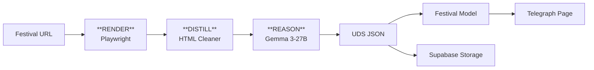

# Universal Festival Parser

## Overview

The Universal Festival Parser enables adding/updating festivals by parsing their official website URLs using a Kaggle notebook with Playwright + Gemma 3-27B LLM.

## Architecture: RDR (Render–Distill–Reason)



### Phases

1. **RENDER** (`render.py`): Playwright fetches and renders the page, saves HTML + screenshot
2. **DISTILL** (`distill.py`): Cleans HTML, extracts main content, removes boilerplate
3. **REASON** (`reason.py`): Gemma 3-27B extracts structured UDS JSON

## Usage

### Via Telegram Bot

1. Send `/fest` command (or tap "➕ Добавить фестиваль")
2. Paste the festival website URL (e.g., `https://zimafestkld.ru/`)
3. Wait for parsing to complete
4. Receive links to:
   - Telegraph page
   - UDS JSON report
   - LLM log (for debugging)

### Re-parsing

From festival edit menu (`/fest` → select festival → Edit), use **"🔄 Перепарсить с сайта"** button to re-run the parser and update the festival data.

## UDS (Universal Data Structure)

Output JSON schema:

```json
{
  "festival": {
    "title_full": "...",
    "title_short": "...",
    "description_short": "...",
    "dates": {"start": "YYYY-MM-DD", "end": "YYYY-MM-DD"},
    "links": {"website": "...", "socials": ["..."]},
    "registration": {"is_free": true, "common_url": "..."},
    "contacts": {"phone": "...", "email": "..."}
  },
  "program": [
    {"title": "...", "type": "...", "date": "...", "time_start": "..."}
  ],
  "venues": [
    {"title": "...", "city": "...", "address": "..."}
  ],
  "images_festival": ["url1", "url2"]
}
```

## LLM Debug Logging

All LLM requests/responses are logged to `llm_log.json`:

```json
{
  "run_id": "20260104T120000Z_abc123",
  "total_interactions": 2,
  "total_prompt_tokens": 5000,
  "total_response_tokens": 2000,
  "interactions": [
    {
      "request_id": "...",
      "phase": "reason",
      "model": "gemma-3-27b",
      "prompt": "...",
      "response": "...",
      "duration_ms": 1500
    }
  ]
}
```

This log is saved to Supabase and linked in the operator chat for analysis.

## Rate Limiting

Gemma 3-27B limits:
- 30 RPM (requests per minute)
- 15K TPM (tokens per minute)
- 14.4K RPD (requests per day)

Token bucket algorithm in `rate_limit.py` handles this automatically.

## Security: API Key Management

Google API key for Gemma is secured via two private Kaggle datasets:

| Dataset | Contains |
|---------|----------|
| `gemma-cipher` | `google_api_key.enc` (Fernet-encrypted) |
| `gemma-key` | `fernet.key` |

Decryption happens in-memory only, never written to disk.

## Database Fields

New Festival model fields:

| Field | Type | Description |
|-------|------|-------------|
| `source_url` | str | Original website URL |
| `source_type` | str | "canonical" / "official" / "external" |
| `parser_run_id` | str | Last parser run ID |
| `parser_version` | str | Parser version used |
| `last_parsed_at` | datetime | Timestamp of last parse |
| `uds_storage_path` | str | Path in Supabase bucket |
| `contacts_phone` | str | Phone contact |
| `contacts_email` | str | Email contact |
| `is_annual` | bool | Is this an annual festival? |
| `audience` | str | Target audience |

## Files

```
source_parsing/
├── festival_parser.py    # Main pipeline
├── date_utils.py         # Russian date formatting

kaggle/UniversalFestivalParser/
├── kernel-metadata.json
├── universal_festival_parser.py  # Main script
└── src/
    ├── render.py         # Playwright rendering
    ├── distill.py        # HTML cleaning
    ├── reason.py         # Gemma LLM extraction
    ├── rate_limit.py     # Token bucket
    ├── secrets.py        # API key decryption
    ├── llm_logger.py     # Request/response logging
    ├── uds.py            # Pydantic schema
    └── config.py         # Configuration

tests/
├── test_festival_parser.py
├── test_festival_date_format.py
└── e2e/features/festival_parser.feature  # Gherkin scenarios
```

## Environment Variables

```bash
# Required for Kaggle kernel
KAGGLE_GEMMA_CIPHER_DATASET=username/gemma-cipher
KAGGLE_GEMMA_KEY_DATASET=username/gemma-key

# Supabase storage bucket
SUPABASE_PARSER_BUCKET=festival-parsing
```
