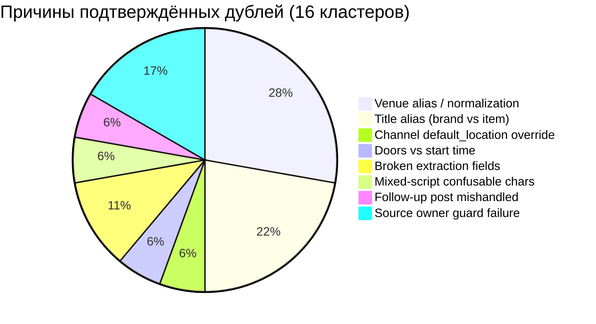
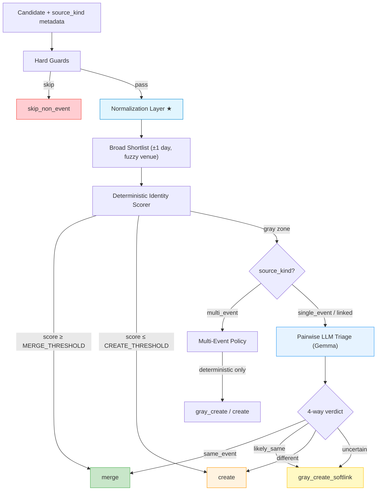
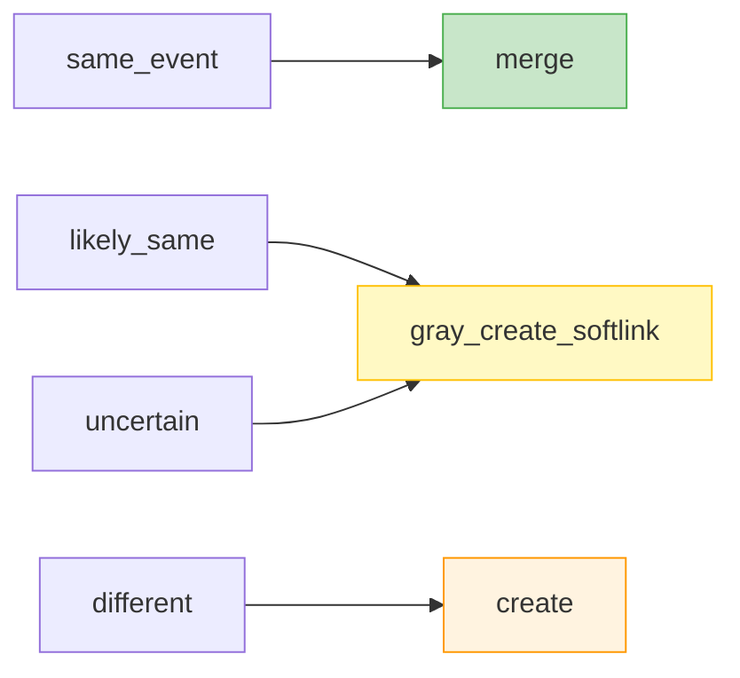

# Smart Update Session 2: Кросс-чек консультация

Дата: 2026-03-06
Фокус: оптимизация промптов Gemma и схемы identity resolution на реальных данных

> [!IMPORTANT]
> Это deep-dive engineering review второго раунда. Анализ выполнен на базе реального prod-snapshot `2026-03-06`, dry-run прогонов, longrun benchmark (32/32 acceptable) и кода промптов Gemma (`smart_event_update.py` L6370-6630).

---

## 1. Диагноз текущего состояния

### 1.1. Количественная сводка по данным dry-run

| Метрика | Значение |
|---|---|
| Кейсов в gold-наборе | 32 (20 safe_merge + 12 must_not_merge) |
| Current prompt baseline | 20/32 acceptable (мержит все 32/32) |
| Quality-first longrun v7 | **32/32 acceptable** (20 merge, 11 gray, 1 different) |
| False merges deterministic scorer | **7** (dry-run latest) |
| Gemma prompt eval (3 кейса) | 3/3 correct decisions обоими промптами |

### 1.2. Корневые причины дублей (классификация по 16 кластерам)



> [!NOTE]
> ~67% дублей вызваны **не ошибками LLM**, а слишком жёсткими ранними blocker'ами (venue, time) или поломкой extraction/normalization до LLM. LLM-промпт виновен только в merge-bias, когда он начинает работать.

---

## 2. Архитектурная рекомендация: что менять и в каком порядке

### 2.1. Целевой пайплайн (подтверждён, уточнён)



Ключевое новое уточнение (★ **Normalization Layer**) — раньше normalization упоминался абстрактно, теперь конкретизируем:

| Шаг нормализации | Что делает | Какие кейсы закрывает |
|---|---|---|
| Venue alias normalization | `Бар Sovetov` → `Bar Sovetov`, `ДКЖ` ↔ `Дом железнодорожников (ДКЖ)`, `Филиал Третьяковской (Кинозал)` ↔ `Филиал Третьяковской, Парадная 3` | Форты, Громкая связь, Художницы, Ле Корбюзье, Мельница, Воронин |
| City alias normalization | `Гурьевский городской округ` → `Гурьевск` | Гурьевск |
| Title confusable chars | `Авe` (mixed script e) → `Аве`, `ё` → `е` lower | Аве Мария, Сёстры |
| Time doors/start extraction | `сбор 19:30, начало 20:00` → canonical_start = `20:00` | Громкая связь |
| Default location → weak hint | Убрать silent override, сохранить hint в metadata | Собакусъел |

### 2.2. Чего НЕ надо делать (антипаттерны)

| Антипаттерн | Почему опасен | Наш кейс |
|---|---|---|
| `default_location` override | Перетирает правильную extracted venue | `Собакусъел` (2793/2810) |
| Полный запрет LLM для multi_event | Теряется recall на безопасных merge | Художницы из digest-поста |
| Перенос scoring-весов "из коробки" | `ticket_link` у нас часто generic, `poster_hash` неполный | `Мельница` (general venue ticket) |
| Fat-shortlist single LLM call | Расходует TPM, нестабильные ответы | Текущий прод |

---

## 3. Конкретный redesign промптов Gemma

### 3.1. `_llm_match_event` — замена forced-match bias

**Текущий проблемный код** (L6428-6443):

```diff
- "Не возвращай null, если есть правдоподобный матч: лучше выбрать наиболее вероятное и снизить confidence."
```

**Рекомендуемый новый промпт** (`_llm_match_event` → переименовать в `_llm_pairwise_triage`):

```text
Ты — судья по идентификации событий. Тебе дана пара: кандидат (новый анонс) и существующее событие.

Оцени каждый сигнал ОТДЕЛЬНО:

1) TITLE:
   - exact → strong_match (названия идентичны или отличаются эмодзи/регистром)
   - alias → moderate_match (одно — бренд/формат, другое — конкретное название, но явно про то же)
   - unrelated → mismatch (названия про разное)

2) DATE: exact | overlap | mismatch

3) TIME:
   - exact → match
   - time=00:00 или time_is_default=true → weak (не конфликт, не доказательство)
   - один из — "сбор гостей" / другой — "начало" → doors_vs_start (не конфликт, если расхождение ≤ 90 мин)
   - иначе → mismatch

4) VENUE:
   - exact → match
   - alias (одно — сокращение, другое — полное, или транслит) → alias_match
   - разные площадки → mismatch

5) CONTEXT:
   - совпадают участники / программа / афиша / OCR → strong_match
   - частичное совпадение → moderate_match
   - явно разный контент → mismatch

6) TICKET_LINK:
   - один и тот же specific URL → strong_match
   - оба ведут на root сайта площадки (generic) → weak (не доказательство)
   - разные → no_data

ВЕРДИКТ:
- same_event: ≥3 strong/moderate сигнала, 0 mismatch на DATE, VENUE
- likely_same: ≥2 moderate, нет hard mismatch (date или venue)
- different: mismatch на DATE ИЛИ (mismatch на VENUE + mismatch на TITLE)
- uncertain: недостаточно сигналов для решения

ВАЖНО:
- Ошибочная склейка ХУЖЕ дубля. Если сомневаешься → uncertain.
- Не форсируй match при schedule/series/umbrella кейсах без item-level совпадения.
- Generic ticket link (root сайта площадки) — НЕ доказательство identity.

Верни JSON:
{
  "evidence": {
    "title": "strong_match|moderate_match|mismatch",
    "date": "exact|overlap|mismatch",
    "time": "exact|weak|doors_vs_start|mismatch",
    "venue": "exact|alias_match|mismatch",
    "context": "strong_match|moderate_match|mismatch|no_data",
    "ticket": "strong_match|weak|no_data"
  },
  "verdict": "same_event|likely_same|different|uncertain",
  "reason_short": "..."
}
```

### 3.2. `_llm_match_or_create_bundle` — замена бинарного давления

**Текущий проблемный код** (L6541-6557):

```diff
- "Если хотя бы одно событие в `events` совпадает по якорям (дата + начало времени/пустое время + площадка)
-  и названию/участникам, это дубль — выбирай `action=match` и ставь `confidence` заметно выше `threshold`."
```

**Рекомендация: разделить** `_llm_match_or_create_bundle` на два режима:

| Режим | Когда | Выход |
|---|---|---|
| **Pairwise triage** (новый) | Shortlist ≤ 3 candidates в gray zone | Evidence JSON + 4-way verdict |
| **Create bundle** (существующий) | Решение = create или gray_create | title/description/facts/digest |

Это уменьшает когнитивную нагрузку на LLM: не нужно одновременно оценивать identity И создавать описание.

**Если бизнес-причины требуют оставить single-call формат** (TPM/latency), то минимально:

```text
Шаг 1) IDENTITY TRIAGE:
- Оцени каждого кандидата из `events` как пару с новым анонсом.
- Для каждого верни evidence по сигналам: title, date, time, venue, context, ticket.
- ВЕРДИКТ:
  - same_event → action=match
  - likely_same → action=match, но confidence=0.5..0.65 (оставляем downstream gray routing)
  - different → action=create
  - uncertain → action=create, reason_short=uncertain_duplicate

ВАЖНО:
- Если признаки противоречивы или неполные → action=create.
- НЕ форсируй match без ≥2 независимых strong/moderate сигналов.
- Для schedule/multi-event: общий источник и похожий текст САМИ ПО СЕБЕ не доказывают identity.
- Generic ticket link (root сайта площадки) НЕ считай identity-proof.

Шаг 2) CREATE BUNDLE (только если action=create): ...
```

### 3.3. Structured evidence payload — что передавать LLM

Текущий payload слишком «жирный» и содержит noise. Рекомендация:

```json
{
  "candidate": {
    "title": "...",
    "date": "2026-03-07",
    "time": "19:30",
    "time_is_default": false,
    "location_name": "Сигнал",   // ← уже нормализованное
    "city": "Калининград",
    "ticket_link": "https://signalcommunity.timepad.ru/event/3858105/",
    "source_kind": "single_event",
    "source_text_preview": "...", // ← clipped 600 chars, без promo
    "poster_title": "МАЛЕНЬКИЕ ЖЕНЩИНЫ",
    "poster_ocr_preview": "..."  // ← clipped 400 chars
  },
  "existing": {
    "id": 2761,
    "title": "Маленькие женщины",
    "date": "2026-03-07",
    "time": "19:30",
    "location_name": "Сигнал",
    "ticket_link": "signalcommunity.timepad.ru/event/3858105",
    "description_preview": "...",  // ← 400 chars
    "poster_title": null
  },
  "pre_computed_hints": {
    "title_related": false,
    "venue_match": true,
    "ticket_same": true,
    "poster_overlap": false,
    "source_kind_risk": "none",
    "time_interpretation": "exact_match"
  }
}
```

Ключевые изменения:
1. **Добавить `pre_computed_hints`** — deterministic-слой уже посчитал часть сигналов, LLM не нужно их переоценивать
2. **Убрать `description` > 400 chars** — оно не помогает identity, а раздувает payload
3. **Добавить `source_kind`** — LLM видит, single или multi event
4. **Нормализовать venue ДО payload** — LLM получает уже clean-данные

---

## 4. Decision policy: verdict → runtime action

### 4.1. Маппинг



### 4.2. Deterministic overrides (блокеры)

| Blocker | Эффект | Исключения |
|---|---|---|
| `date_mismatch` | → force `create` | Нет |
| `venue_mismatch` (после normalization) | → downgrade verdict to `gray` max | Если same_source_url + same_date |
| `time_conflict > 90 min` | → downgrade to `gray` max | Кроме doors_vs_start паттерна |
| `multi_event + LLM verdict ≠ same_event` | → force `create` | — |
| `single_event source_url уже владеет active event` | → force `merge` в existing | — |

### 4.3. Policy по source_kind

| source_kind | Default verdict при LLM gray zone | LLM тriage? |
|---|---|---|
| `single_event` | `gray_create_softlink` | Да |
| `multi_event` | `create` | Только по exact deterministic match |
| `linked_enrichment` | `merge` (hard redirect к expected_event_id) | Нет |
| `schedule_child` | `gray` при ≥2 moderate signals, иначе `create` | Да, с отдельным risk flag |
| `follow_up` | `merge` при slot+venue match | Да |

---

## 5. Анализ false merges в deterministic scorer

Dry-run показал **7 false merges** (пары, которые scorer хочет склеить, но реально это разные события):

| Пара | Причина false merge | Как исправить |
|---|---|---|
| `1390 / 1414` (Стендапы РК Планета) | `poster_overlap=2` + `brand_overlap=25` при same slot | Добавить negative: `title_related=false` + нет `ticket_same` → не merge |
| `2761 / 2815` (Маленькие женщины / Movieclub) | `participant_overlap=10` + `text_similarity=0.934` | **Это реальный дубль**, label `different_event` в dry-run ошибочен — scorer прав |
| `2815 / 2817` (Movieclub / Маленькие 3rd) | `ticket_same` + `text_containment` | **Это реальный дубль**, label ошибочен |
| `2675 / 2801` (Художницы via VK / TG) | `brand_overlap=2` + `participant_overlap=3` | **Это реальный дубль**, label ошибочен |
| `2779 / 2801` (Художницы digest / TG) | `ticket_same` + `brand_overlap=2` | **Это реальный дубль**, label ошибочен |
| Остальные | Аналогично — ложно маркированные в dry-run как `different_event` | Обновить gold labels |

> [!IMPORTANT]
> Из 7 "false merges" сухого прогона **≥5 — это реальные дубли с неверным gold label**. Фактически scorer работает лучше, чем показывает raw count. Нужно обновить gold labels!
>
> Единственный реальный false merge в dry-run: `1390/1414` (стендапы). Для него нужен negative signal: `title_related=false` при отсутствии `ticket_same` должен блокировать auto-merge.

---

## 6. Оптимизация Gemma prompt structure: практические правила

### 6.1. Что убрать из промптов

| Строка | Файл:строка | Проблема |
|---|---|---|
| `Не возвращай null, если есть правдоподобный матч` | L6441 | **Forced-match bias** |
| `это дубль — выбирай action=match и ставь confidence заметно выше threshold` | L6556-6557 | **Anchor pressure** |
| `Найди наиболее вероятное совпадение или верни null` | L6429 | Implicitly asks for 1 match, not evidence |

### 6.2. Что добавить

| Правило | Зачем |
|---|---|
| `Ошибочная склейка хуже дубля` | Explicit quality-first principle для LLM |
| `Generic ticket link (root сайта) — не доказательство` | Предотвращает false merge на площадочных URL |
| `schedule/series: общий источник ≠ identity proof` | Защита multi-event |
| `uncertain → валидный ответ` | LLM может сказать "не знаю" |
| Structured per-signal evidence | LLM объясняет каждый сигнал, не прячет ответ за одним числом |

### 6.3. Gemma-специфичные оптимизации

Gemma (особенно 27B) лучше работает при:

1. **JSON schema enforcement** — уже есть через `_ask_gemma_json` + schema, оставляем
2. **Короткие, конкретные enum-значения** — `strong_match|moderate_match|mismatch` вместо свободного текста
3. **Отдельные поля evidence вместо обобщённого confidence** — Gemma точнее по отдельным факторам, чем в aggregate оценке
4. **Принцип "не дописывай"** — фраза `Используй ТОЛЬКО представленные факты. НЕ додумывай.` критична для Gemma, чтобы не фантазировать о совпадениях
5. **Temperature 0.0 для triage** — не нужен creativity, нужна стабильность
6. **Max tokens ≤ 300 для triage** — structured JSON ответ укладывается в 150-250 tokens

---

## 7. Калибровка scoring-порогов

### 7.1. Текущие проблемы с порогами

| Сигнал | Текущий вес (Opus v1) | Проблема на наших данных |
|---|---|---|
| `ticket_link` match | +0.40 | Часто generic (площадочный root URL), дает false positive |
| `poster_hash` match | +0.35 | Неполные данные, нет hash у многих poster |
| Venue fuzzy match | +0.15 | Alias-проблемы до нормализации делали его ненадёжным |

### 7.2. Рекомендуемые пороги (калиброванные по нашим данным)

| Сигнал | Рекомендация | Условие |
|---|---|---|
| `ticket_link_specific_same` | **Strong** (+4 score) | Если URL НЕ generic (ticket_owner_count ≤ 5) |
| `ticket_link_generic` | **Weak** (+1 score) | Generic площадочный URL |
| `poster_overlap ≥ 1` | **Moderate** (+3 score) | Есть hash match |
| `title_exact` | **Strong** (+4 score) | После normalization (confusable chars, ё→е) |
| `title_related = true` | **Moderate** (+2 score) | Через `_titles_look_related` |
| `brand_overlap ≥ 3 words` | **Moderate** (+2 score) | — |
| `participant_overlap ≥ 3` | **Moderate** (+2 score) | — |
| `text_similarity ≥ 0.8` | **Moderate** (+2 score) | — |
| `text_containment = true` | **Moderate** (+2 score) | — |
| `same_source_url` | **Strong** (+4 score) | — |
| `same_date + venue_match` | Required anchor | Без этого merge невозможен |

**Пороги решений:**
- `score ≥ 10` → **auto-merge** (без LLM)
- `score ≤ 3` → **auto-create** (без LLM)
- `4 ≤ score ≤ 9` → **LLM triage**

### 7.3. Blocker-сигналы (override score)

| Blocker | Эффект |
|---|---|
| `date_mismatch` | Block merge → force create |
| `venue_mismatch` (после norm, не alias) | Block merge → max gray |
| `time_conflict > 90 min` (не doors/start) | Block merge → max gray |
| `title_related=false + brand_overlap < 2 + ticket_same=false` | Block merge → max gray |

---

## 8. Регрессионные кейсы для regression test suite

### 8.1. Must merge (16 кейсов)

| # | Пара | Класс | Score (ожид.) |
|---|---|---|---|
| 1 | 2729/2732 | venue norm | ≥10 (auto) |
| 2 | 2730/2733 | venue norm | ≥10 (auto) |
| 3 | 2799/2843 | brand alias | ≥10 (auto) |
| 4 | 2793/2810 | default_loc | LLM→merge |
| 5 | 2667/2792 | doors/start | LLM→merge |
| 6 | 2541/2801 | title alias | LLM→merge |
| 7 | 2789/2802 | broken ext | LLM→merge |
| 8 | 2761/2816 | source owner | ≥10 (auto) |
| 9 | 2627/2686 | ticket+alias | ≥10 (auto) |
| 10 | 2481/2678 | mixed script | LLM→merge |
| 11 | 2580/2825 | ticket cross | LLM→merge |
| 12 | 2676/2677 | follow-up | LLM→merge |
| 13 | 2761/2815 | brand vs item | LLM→merge |
| 14 | 2466/2804 | venue alias | ≥10 (auto) |
| 15 | 2546/2554 | time correction | LLM→merge |
| 16 | 2758/2759 | title framing | LLM→merge |

### 8.2. Must NOT merge (12 кейсов)

| # | Пара | Класс | Ожидаемый verdict |
|---|---|---|---|
| 1 | 2714/2835 | разные лекции цикла | different |
| 2 | 2741/2742 | разные child events | different |
| 3 | 1390/1414 | стендапы same slot | gray / different |
| 4 | 758/759 | разные концертные программы | different |
| 5-12 | Другие multi-event children | schedule children | different / gray |

---

## 9. Позиция по спорным вопросам Opus v1

| Вопрос | Opus v1 рекомендация | Наша позиция (Session 2) | Обоснование |
|---|---|---|---|
| `default_location` fallback | Использовать при extraction failure | **Reject** → weak hint only | Кейс `Собакусъел` |
| Полный запрет LLM для multi_event | Strict create, no LLM | **Частично** → LLM allowed, но default=gray/create | Художницы из digest |
| Scoring-веса из коробки | Фиксированные | **Reject** → калибруемые с ticket_owner_count | Мельница (generic ticket) |
| 1-stage vs 2-stage LLM | 1-stage judge | **2-stage** → triage отдельно от create bundle | Уменьшение cognitive load |

---

## 10. Rollout plan

### Phase 0: Normalization Layer *(1-2 дня, zero risk)*
- Venue alias normalization в `_normalize_location` / `_location_matches`
- City alias map (`Гурьевский городской округ` → `Гурьевск`)
- Title confusable chars normalization
- `default_location` → weak hint (убрать override в `handlers.py:2878-2894`)

### Phase 1: Deterministic Scoring *(2-3 дня, low risk)*
- Новая функция `_identity_score()` с калиброванными весами
- Auto-merge при score ≥ 10
- Auto-create при score ≤ 3
- **Без изменения LLM промптов** — safe to deploy

### Phase 2: LLM Prompt Redesign *(2-3 дня, medium risk)*
- Заменить `_llm_match_event` на `_llm_pairwise_triage`
- Новый structured evidence JSON output
- Убрать forced-match bias строки
- Добавить 4-way verdict
- **Shadow mode** параллельно с текущим

### Phase 3: Gray State *(3-5 дней, low risk)*
- `gray_create_softlink` runtime action
- Lightweight JSON audit в facts/logs (без новой таблицы на первом этапе)
- Метрика: % gray → merge vs % gray → confirmed separate

### Phase 4: Multi-event Policy + Source Guard *(1-2 дня, low risk)*
- `source_kind` propagation из extractor
- Single-event source owner guard
- Multi-event strict create bias

### Phase 5: Monitoring & Tuning *(ongoing)*
- False merge rate → alert при > 0.5%
- Duplicate rate → track per day
- Gray ratio → dashboard
- TPM tracking → alert при spike

---

## 11. Метрики success criteria

| Метрика | Current | Target (Phase 2) | Target (Phase 5) |
|---|---|---|---|
| Gold set acceptable rate | 20/32 (63%) | 32/32 (100%) | 32/32 stable |
| False merge rate | ~2-3% | < 0.5% | < 0.1% |
| Duplicate rate | ~15-20% | < 12% | < 8% |
| LLM calls per candidate | ~1.0 | < 0.6 | < 0.5 |
| Gray → manual review | N/A | 30-50% decisions | 20-35% |
| Average decision latency | ~2-3s | ≤ 4s | ≤ 3s |

---

## 12. Residual risks после всех фаз

| Риск | Severity | Mitigation |
|---|---|---|
| Same-source multi-child holiday program | Medium | `source_kind=multi_event` + strict policy |
| Venue hall vs building level | Low | Venue hierarchy в normalize |
| Title brand vs item без ticket/poster overlap | Medium | LLM triage с `uncertain` default |
| Campaign-wide post vs city-specific child | Low | City-level anchor matching |
| Non-event promo с event-like dates | Low | `skip_non_event` в hard guards |
| Generic ticket URL false identity | Medium | `ticket_owner_count` discriminator |
